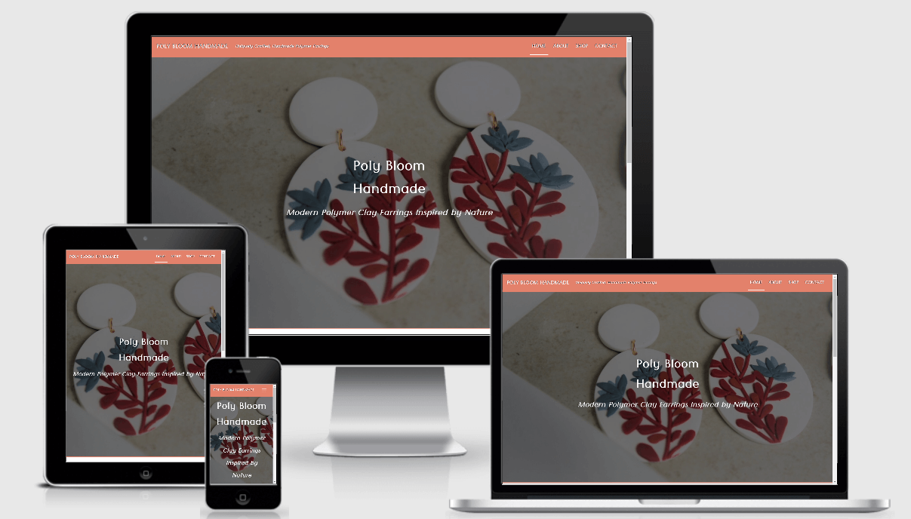
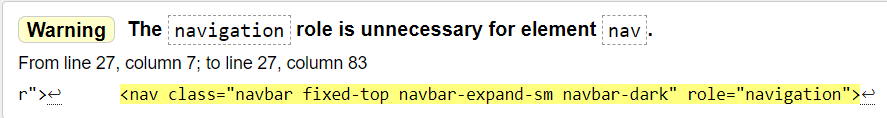
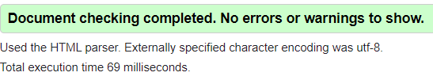
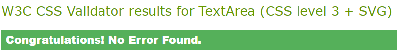

# Poly Bloom Handmade 

This is a static product website made in accordance with the guidelines for my 1st Milestone Project in the Code Institute Full Stack Web Developer Course. 

Poly Bloom Handmade is a real business dedicated to designing handmade, quality and unique polymer clay earrings based in Morelos Mexico.

A link to the deployed page can be found <a href="https://craig-ryan.github.io/MS1-Project-Poly-Bloom-Handmade/index.html">here</a>.

## UX

### Project Aim

I decided to make this site in order to promote Poly Bloom Handmade. My plan was to build an attractive, intuitive and infomative website that represented the elegance and simplicity associated with the products on sale. 

My intentions were to improve overall customer interaction and brand awareness. Keeping customers up to date with the brand's social feed was a high priority as well as having links nested within the site to the online store where actual Poly Bloom Hanmade products can be purchased.

### User Stories

<ul>
    <li>As an owner I want to be able to promote my brand and my products online.</li>
    <li>As an owner I want to instill a sense of luxury and simplicity represented by an intuitive and well laid out website that offers ease of browsing to my customers.</li>
    <li>As an owner I want the ability to keep my audience engaged with new content.</li>
    <li>As a user I want to be able to find what I'm looking for within the least number of clicks.</li>
    <li>As a user I want to purchase Poly Bloom Handmade products easily through the site.</li>
    <li>As a user I want to be able to find the company through all of it's social media and other online platforms.</li>
    <li>As a new potential customer I want to immediately understand the sentiment behind the brand and get a feeling for the quality of the products on offer through positive verified customer reviews.</li>
</ul>

#### The website is spread out over 4 pages:
<ul>
<li>Home - Users are introduced to the brand with a heading outlining the name and some introductory text explaining the product. I included an Instagram Feed widget in order to keep users up to date with the social media element of the business.</li>
<li>About - A brief biography section outlines the origin of the company, it's owner and her vision for the brand.</li>
<li>Shop - A storefront with a gallery of collections for the customer to browse with functional links to real products on the company's Etsy page. There is also a customer reviews section to improve the brand's reputation.</li>
<li>Contact - A means for the customer to sign up to a future monthly newsletter from Poly Bloom Handmade.</li>
</ul>

Within the footer there are functioning links to various social media platforms and a link to the online Etsy store where Poly Bloom Handmade products can be purchased.

Using Bootstrap 4 allowed for this project to be responsive on all devices with an emphasis on a mobile first design approach.

### Wireframes

<table>
    <thead>
        <tr>
            <th align="center">Mobile</th>
            <th align="center">Tablet</th>
            <th align="center">Desktop</th>
        </tr>
    </thead>
    <tbody>
        <tr>
            <th align="center"><a href="./assets/wireframes/home-mobile.png">Home</a></th>
            <th align="center"><a href="./assets/wireframes/home-tablet.png">Home</a></th>
            <th align="center"><a href="./assets/wireframes/home-desktop.png">Home</a></th>
        </tr>
        <tr>
            <th align="center"><a href="./assets/wireframes/about-mobile.png">About</a></th>
            <th align="center"><a href="./assets/wireframes/about-tablet.png">About</a></th>
            <th align="center"><a href="./assets/wireframes/about-desktop.png">About</a></th>
        </tr>
        <tr>
            <th align="center"><a href="./assets/wireframes/shop-mobile.png">Shop</a></th>
            <th align="center"><a href="./assets/wireframes/shop-tablet.png">Shop</a></th>
            <th align="center"><a href="./assets/wireframes/shop-desktop.png">Shop</a></th>
        </tr>
        <tr>
            <th align="center"><a href="./assets/wireframes/contact-mobile.png">Contact</a></th>
            <th align="center"><a href="./assets/wireframes/contact-tablet.png">Contact</a></th>
            <th align="center"><a href="./assets/wireframes/contact-desktop.png">Contact</a></th>
        </tr>
    </tbody>
</table>

## External Libraries and Technologies Used

### Languages

<ul>
<li><a href="https://en.wikipedia.org/wiki/HTML">HTML 5</a></li>
<li><a href="https://en.wikipedia.org/wiki/Cascading_Style_Sheets">CSS 3</a></li>
</ul>

### Tools
<ul>
<li><a href="https://getbootstrap.com/docs/4.4/getting-started/introduction/">Bootstrap 4</a> - I used Bootstrap4 for the Navbar, Grids, Carousel and Footer included in this project.</li>

<li><a href="https://fonts.google.com/">Google Fonts</a> - The 2 main fonts used in this project came from Google Fonts</li>

<li><a href="https://fontawesome.com/start">Font Awesome</a> - Social Media Icons were taken from Font Awesome</li>

<li><a href="https://color.adobe.com/en/create/color-wheel">Adobe Color Wheel</a>- The main color used #E3816B was taken from Adobe Color Wheel</li>

<li><a href="https://stackoverflow.com/questions/24222798/how-to-remove-the-blue-box-shadow-border-in-button-if-clicked">Stack Overflow</a> - I used Stack Overflow for help with the box shadow on the contact form.</li>

<li><a href="https://www.google.com/imghp">Google Images</a> - I took images from Google Images with usage rights allowed for modifications.</li> 

<li><a href="https://mdbootstrap.com/docs/jquery/navigation/footer/">MD Bootstrap</a> - I made the footer using code from mdbootstrap.com
</li>

<li><a href="https://www.powr.io/">Powr.io</a> - Source of Instagram Feed Embedded Widget.</li> 

<li><a href="https://favicon.io/">Favicon.io</a> - I used favicon to generate the icon displayed next to the website title.</li>

<li><a href="https://autoprefixer.github.io/">Auto Prefixer</a> - I used this to ensure my CSS was void of errors.</li>

<li><a href="https://github.com/">Github</a> - The project was hosted on Github. </li>

<li><a href="https://www.gitpod.io">Gitpod</a> - I wrote and styled the entire project using Gitpod.</li>

<li><a ref="http://ami.responsivedesign.is/">Am I Responsive</a> - I used this to ensure my site was responsive across all devices</li>

<li><a ref="https://tinypng.com/">Tiny PNG</a> - I used this to compress images so they would load faster on the page.</li>

</ul>

## Features

### Included Features

Header 
<ul>
    <li>Navbar - which includes links to all parts of the website. It is also fixed so no matter where you are on the site you know where you are and are one click away from the content you want.</li>
</ul>

Sections
<ul>
    <li>Across each page lies a main image of Poly Bloom Handmade earrings before the main content of the page. I wanted it to be blatantly obvious what the website was promoting at the start of each page.</li>
</ul>

Footer 
<ul>
    <li>The footer contains all links to the various social media platforms as well as copyright text for the company.</li>
</ul>

Home Page 
<ul>
    <li>A fullpage sized image of a pair of Poly Bloom Handmade earrings sits in the background while in the foreground lies an introduction to the brand name and a short description of the product.</li>
    <li>An instagram feed with up to date posts to keep users updated is also included here.</li>
</ul>

About Page 
<ul>
    <li>A large image of the company's owner and sole employee sits side by side with short biographical paragraphs on the about page.</li>
</ul>

Shop Page
<ul>
    <li>I implemented a shop by collection section with a grid of images with underlying names attached. Within the names there are nested links to the 3rd party store..</li>
    <li>Following the shop collection are fictional customer reviews to strengthen the brand's reputaion for quality products.</li>
</ul>

Contact Page 
<ul>
    <li>A simple contact form with instructions for customers to sign up to a company newsletter is located here.</li>
</ul>

### Future Features to be Added
<ul>
<li>Given my inexperience, I will later add a fully functional online store to the Shop page with the possibility to buy products directly from the site instead of visiting a 3rd party site.</li>

<li>The monthly newsletter is something I intend to make a reality soon and potentially a blog section relating to the earring making process.</li>

<li>I will improve the Instagram feed once I have more experience with jquery.</li>
</ul>

## Testing 

### HTML

Using <a href="https://validator.w3.org/nu/">W3 HTML Validator</a> the following issues were found:

Home - resulted in a warning about a lack of headers in the Instagram Feed section. No action was taken as I viewed this more as a suggestion than a threat: 

About, Shop & Contact pages returned no warnings:

Navbar - All links are functional and perform as desired. Navbar is responsive across all devices.

Home Page - Instagram feed links directly to the Poly Bloom Handmade Instagram page and is updated every 24 hours. 

Sections - Are responsive across all devices and functioning as desired. 

Contact Form - Is fully functional and returns all input information as designed. 

Footer - All links are functional and open into a new page when clicked.

All pages across the site are <strong>mobile friendly</strong> according to <a href="https://search.google.com/test/mobile-friendly">Mobile Friendly Test</a>.

### CSS

Using <a href="http://jigsaw.w3.org/css-validator/validator">W3 CSS Validator</a> no errors found in my CSS style sheet:

I uploaded the link to my Github pages for this project for peer review on Slack.

## Deployment 

This website is available to view publicly on Github Pages.

Github Pages - https://craig-ryan.github.io/MS1-Project-Poly-Bloom-Handmade/index.html

Github Repository - https://github.com/Craig-Ryan/MS1-Project-Poly-Bloom-Handmade

## Credit 

### Media
All images used except for the carousel images are the property Tania Salas of Poly Bloom Handmade.

### Acknowledgements

Inspiration was drawn from the websites of <a href="https://www.shamushandmade.com/">Shamus Handmade</a> and <a href="https://www.claybycait.com/collections">Clay by Cait</a>.

A big thanks to <a href="https://github.com/akshatnitd">Akshat Garg</a>, all the staff at Code Institute and all of the fellow coders on Slack for the advice along this project.

